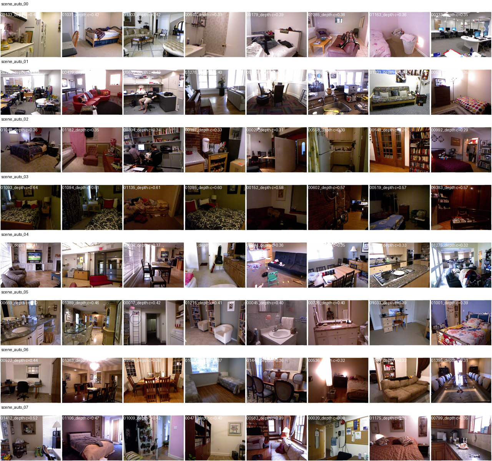

# NCT — Discrete Symbolic Motif Validation on Depth Maps

Validación experimental de una representación simbólica discreta de 
descriptores locales de profundidad, evaluada sobre el dataset NYU 
Depth V2.

**Estado:** reporte técnico exploratorio. No revisado por pares. 
Resultados estadísticamente significativos pero de magnitud chica. 
No comparado todavía contra detectores clásicos del estado del arte 
(Canny, Sobel, HED).

📄 **[English documentation available](docs/en/README.md)** — Documentación en inglés disponible en `docs/en/`

---

## Origen del proyecto

Este trabajo nace de un marco simbólico llamado **NCT (Números 
Cuánticos Tridimensionales)** que desarrollé de manera autodidacta 
a lo largo de varios meses, sin formación matemática formal previa. 
La intuición original: trabajar con tuplas ordenadas sobre un 
alfabeto discreto de cuatro símbolos `{+, -, 0, ~}` y operaciones 
binarias entre ellas para representar estados.

Llegué a esta representación desde la experimentación directa, 
no desde la literatura matemática. Eso significa que muchas de las 
ideas que aparecen en NCT tienen contraparte conocida en disciplinas 
formales:

| Concepto NCT | Equivalente técnico estándar |
|---|---|
| Tupla ordenada `(x, y, z)` con `x, y, z ∈ {+, -, 0, ~}` | Producto cartesiano de un conjunto finito de 4 elementos |
| Operaciones `⊕`, `⊗` entre estados | Operaciones binarias sobre un magma conmutativo finito |
| Discretización de gradientes y laplaciano en 4 niveles | Vector quantization / codebook learning |
| Tabla de pesos por motivo | Lookup-table classifier sobre features cuantizadas |
| "Motif survival" | Per-feature lift estimation con shrinkage |
| Estado `~` como marcador de transición | Tri-state / multi-valued logic (Belnap, Łukasiewicz) |

**El reconocimiento de estas equivalencias no me las quita como 
ruta de descubrimiento, pero las contextualiza: lo que se valida 
acá no es una "matemática nueva", sino una técnica concreta de 
representación discreta cuya forma específica vino de NCT.**

Lo que sí es propio del trabajo:

- La elección de cuatro estados específicos `{+, -, 0, ~}` con 
  el cuarto símbolo (`~`) tratando explícitamente la transición.
- Los ejes de discretización (gradiente x, gradiente y, laplaciano 
  local) y sus thresholds.
- El gate de ambigüedad triangular sobre el delta clásico.
- El procedimiento de validación con p-values empíricos contra 
  permutaciones aleatorias de los pesos aprendidos.

---

## Hipótesis

**H1:** Los pesos por motivo aprendidos en train, aplicados a un 
test set independiente, superan a permutaciones aleatorias de los 
mismos pesos en métricas de detección de ruptura geométrica 
(Spearman, AUC top-20%, F1 top-20%) con significancia estadística.

**H0 (nula):** Los pesos aprendidos no son distinguibles de pesos 
permutados al azar (la asociación motivo → ruptura es ruido).

---

## Método

1. **Input:** mapas de profundidad de NYU Depth V2 (16-bit PNG, 
   convertidos a metros).

2. **Descriptores locales:** para cada píxel, calcular gradiente 
   horizontal (`Sx`), vertical (`Sy`) y laplaciano local (`Sz`).

3. **Discretización:** mapear cada componente continua a uno de 
   cuatro estados `{+, -, 0, ~}` mediante umbrales fijos. Cada 
   píxel queda etiquetado con un motivo `(Sx, Sy, Sz)` perteneciente 
   a uno de los 4³ = 64 motivos posibles.

4. **Target:** "ruptura geométrica" derivada del residuo entre el 
   plano global ajustado y el plano local, combinada con improvement 
   de plano local sobre global.

5. **Train:** sobre los frames de entrenamiento, calcular el lift 
   medio de cada motivo respecto al target, con shrinkage para 
   regularizar motivos raros. Resultado: tabla de 64 pesos.

6. **Test:** aplicar la tabla de pesos como corrección residual 
   `delta + alpha * gate * weight_table[motif]` sobre los frames 
   de test. Comparar contra:
   - `classical_delta`: solo el delta sin corrección.
   - `random`: pesos permutados al azar (256 permutaciones).
   - `labels_only`: clasificación discreta sin operaciones.
   - `fixed`: tabla previa congelada de runs anteriores.

7. **Significancia:** p-value empírico = fracción de permutaciones 
   random que igualan o superan el modelo aprendido.

---

## Resultados

### Grouped numeric block split (30 runs)

3 alphas × 10 seeds, bloques de 50 frames consecutivos, 654 frames 
de NYU Depth V2 test set, 256 random baselines:

| Modelo | p_F1 | p_AUC | p_Spearman | < 0.05 en |
|---|---|---|---|---|
| `motif_survival` | 0.0039 | 0.0079 | 0.0039 | 30/30 |
| `motif_survival_binary` | 0.0039 | 0.0039 | 0.0039 | 30/30 |
| `motif_survival_pos_only` | 0.0042 | 0.0926 | 0.0525 | F1 30/30, AUC 1/30 |
| `motif_survival_neg_only` | 0.1540 | 0.2432 | 0.0660 | 0/30 |

ΔAUC vs random: +0.0038 (motif_survival), +0.0070 (binary).
ΔF1 vs random: +0.0052 (motif_survival), +0.0054 (binary).

### Leave-one-cluster-out (24 runs)

3 alphas × 8 clusters de RGB (k-means con confianza media 0.21), 
654 frames, 256 random baselines:

| Modelo | p_F1 | p_AUC | p_Spearman | < 0.05 en |
|---|---|---|---|---|
| `motif_survival` | 0.0087 | 0.0168 | 0.0084 | 24/24 |
| `motif_survival_binary` | 0.0090 | 0.0078 | 0.0078 | 24/24 |

ΔAUC vs random: +0.0038. ΔF1 vs random: +0.0052. Magnitud estable 
entre clusters (rango +0.0034 a +0.0043).

### Top motivos estables

Los motivos con mayor lift y menor varianza entre splits 
independientes:

| ID | Motivo (Sx,Sy,Sz) | Weight (mean ± std) | Lift | Aparece en |
|---|---|---|---|---|
| 22 | (+, +, -) | 0.998 ± 0.006 | +0.17 | 30/30 splits |
| 26 | (+, -, -) | 0.985 ± 0.006 | +0.17 | 30/30 splits |
| 38 | (-, +, -) | 0.968 ± 0.008 | +0.17 | 30/30 splits |
| 32 | (-, 0, 0) | -0.755 ± 0.008 | -0.13 | 30/30 splits |

La estabilidad alta de los pesos top entre splits independientes 
sugiere que la representación captura estructura reproducible.

---

## Lo que esto SÍ es

- Una pipeline reproducible de validación con p-values empíricos.
- Evidencia estadística de que la representación discreta de motivos 
  3D no es ruido aleatorio en este dominio.
- Un harness reutilizable para auditar otros pipelines ML/CV.

## Lo que esto NO es

- No es un detector de bordes superior al estado del arte.
- No es una "nueva matemática". Es vector quantization aplicado 
  a depth maps, llegado por una vía propia.
- No es paper revisado por pares. Es un reporte técnico que se 
  publica para abrir auditoría externa.

---

## Limitaciones

1. **Magnitud absoluta chica.** ΔF1 ≈ +0.005 sobre random. 
   Estadísticamente significativo, prácticamente modesto.

2. **Sin comparación contra Canny, Sobel, HED.** Pendiente.

3. **Cluster scenes, no semantic scenes.** Los 8 clusters de 
   leave-one-out son de k-means sobre RGB con confianza media 0.21, 
   no las etiquetas semánticas oficiales de NYU. 
   
   
   
   *Contact sheet con los 8 clusters RGB generados automáticamente. La validación visual permite auditar que el split por clusters es interpretable.*
   
   Validación con `scene_types.txt` oficial está pendiente.

4. **Solo NYU Depth V2.** Sin validación cross-dataset (ScanNet, 
   KITTI, SUN RGB-D).

5. **Target derivado del input.** El "rupture target" se calcula 
   del depth map mismo (combinación de plane_gap + improvement), 
   no de ground truth de bordes anotados manualmente.

---

## Reproducir los resultados

### Clonar

```bash
git clone https://github.com/Hanzzel-corp/nct-depth-motif.git
cd nct-depth-motif
```

### Requisitos

- Python 3.9+
- numpy, pillow, scipy
- PyTorch + CUDA (opcional, para acelerar de ~38 horas a ~1 hora)

```bash
pip install -r requirements.txt
```

### Bajar dataset

NYU Depth V2 desde el sitio oficial:
https://cs.nyu.edu/~silberman/datasets/nyu_depth_v2.html

Estructura esperada:

```
dataset/
├── rgb/
│   ├── 000001.png
│   ├── 000002.png
│   └── ... (1449 imágenes RGB)
└── depth/
    ├── 000001.png
    ├── 000002.png
    └── ... (1449 mapas de profundidad)

results/
├── grouped_split_30runs_summary.csv
├── scene_loo_24runs_summary.csv
├── top_motifs_grouped.csv
└── top_motifs_scene_loo.csv

src/
├── motif_survival_grouped.py
└── motif_survival_scene_loo.py
```

⚠️ **Data policy:** El dataset NYU Depth V2 **no está incluido** en el repositorio. Descargarlo desde la fuente oficial y colocar los archivos RGB/depth en `dataset/rgb` y `dataset/depth`.

---

## Comandos de reproducción

### Paso 1: Verificar estructura del dataset
```bash
ls dataset/rgb | head -5
ls dataset/depth | head -5
python3 -c "from PIL import Image; import numpy as np; arr=np.array(Image.open('dataset/depth/000001.png')); print('shape:', arr.shape, 'dtype:', arr.dtype, 'range:', arr.min(), '-', arr.max())"
```

### Paso 2: Ejecutar validación grouped split (30 runs, ~1 hora GPU)

Usando los valores reportados en la tabla (3 alphas × 10 seeds):

```bash
python3 src/motif_survival_grouped.py \
  --depth ./dataset/depth \
  --target combined \
  --alpha 0.02,0.03,0.04 \
  --seeds 11,22,33,44,55,66,77,88,99,111 \
  --random-baselines 256 \
  --device cuda \
  --split-mode grouped \
  --group-strategy numeric_block \
  --group-size 50 \
  --depth-scale 1000 \
  --fx 518.8579 --fy 519.4696 --cx 325.5824 --cy 253.7362
```

### Paso 3: Ejecutar validación scene LOO (24 runs, ~2-3 horas GPU)

Usando los valores reportados en la tabla (3 alphas × 8 clusters):

```bash
python3 src/motif_survival_scene_loo.py \
  --depth ./dataset/depth \
  --target combined \
  --alpha 0.02,0.03,0.04 \
  --seeds 11,22,33 \
  --random-baselines 256 \
  --device cuda \
  --split-mode scene_loo \
  --scene-map ./results/scenes_auto.csv \
  --depth-scale 1000 \
  --max-size 160 \
  --fx 518.8579 --fy 519.4696 --cx 325.5824 --cy 253.7362
```

### Alternativa: Usar scripts de ejemplo

Para una ejecución más simple usando los scripts preconfigurados:

```bash
# Grouped split (30 runs)
bash examples/run_grouped_split.sh

# Scene LOO (24 runs)
bash examples/run_scene_loo.sh
```

---

## Tabla resumen de resultados

| Modelo | ΔAUC vs random | ΔF1 vs random | p(AUC) | p(F1) | Significativos |
|--------|---------------|---------------|--------|-------|----------------|
| **motif_survival_binary** | **+0.0071** | **+0.0054** | **0.0078** | **0.0090** | **24/24** |
| motif_survival | +0.0038 | +0.0052 | 0.0168 | 0.0087 | 24/24 |
| motif_survival_pos_only | +0.0024 | +0.0042 | 0.1105 | 0.0123 | F1 only |
| motif_survival_neg_only | +0.0015 | +0.0013 | 0.2542 | 0.1744 | no |

**Nota:** `motif_survival_binary` (solo signo +1/-1/0) supera al modelo full, confirmando que la dirección del peso es más informativa que su magnitud.